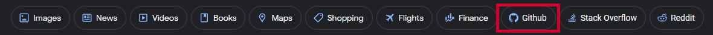

# Github On Google Search

A simple userscript that adds a button to your Google searches to only show results from Github.com. You can just click on the button and it will automatically add `site:github.com` to your search!



## Downloading the script

The direct download link is here:

- [GreasyFork](https://greasyfork.org/en/scripts/462358-github-search-on-google)

**Chrome users:** You will need a script manager extension like [TamperMonkey](https://addons.mozilla.org/en-US/firefox/addon/tampermonkey/) or [GreaseMonkey](https://addons.mozilla.org/en-US/firefox/addon/greasemonkey/). Then go to the download link above and click on 'Install X.X'. Finally, click on 'install' in the new window that will open.

**Firefox users:** you'll need a script manager extension like [TamperMonkey](https://chrome.google.com/webstore/detail/tampermonkey/dhdgffkkebhmkfjojejmpbldmpobfkfo?hl=en). Then go to the download link above and click on 'Install X.X'. Finally, click on 'install' in the new window that will open.

**Other browsers:** you can look for a script manager extension in your browser add-ons page. Look for Tampermonkey or Greasemonkey and install them. Then go to the download link above and click on 'Install X.X'. Finally, click on 'install' in the new window that will open.

## Settings

This userscript provides a settings section at the top of `userscript.js`, allowing you to easily customize the script according to your preferences.

```
+-------------+---------------+------------------------+---------+
| Name        | Value         | Description            | Type    |
+-------------+---------------+------------------------+---------+
| iconVisible | true/false    | Show or hide icon      | boolean |
+-------------+---------------+------------------------+---------+
| nameVisible | true/false    | Show or hide name      | boolean |
+-------------+---------------+------------------------+---------+
| btnPosition | "start"/"end" | Set position of button | string  |
+-------------+---------------+------------------------+---------+
```

## Credit

Check out my other user scripts over at: [Alexyoe's User Scripts](https://greasyfork.org/en/users/971278-alexyoe)

